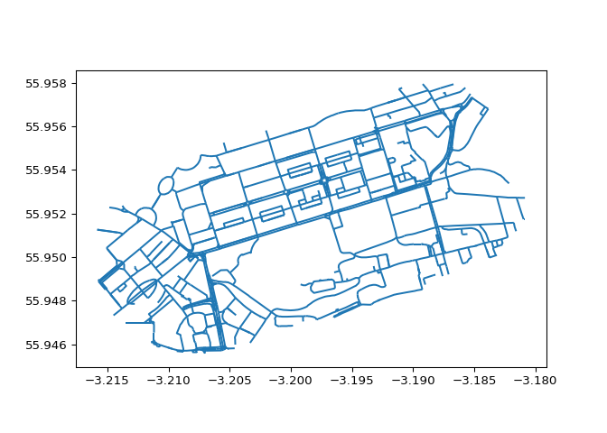
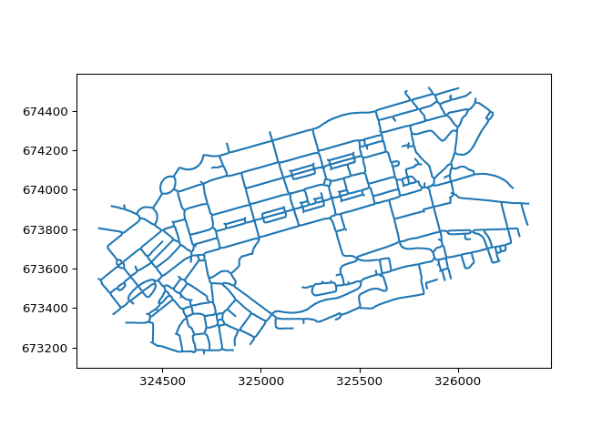

# Testing network simplification with parenx + rnetmatch


``` bash
pip install parenx
```

    Defaulting to user installation because normal site-packages is not writeable
    Requirement already satisfied: parenx in /home/robin/.local/lib/python3.10/site-packages (0.4.8)
    Requirement already satisfied: geopandas in /home/robin/.local/lib/python3.10/site-packages (from parenx) (0.14.1)
    Requirement already satisfied: pyogrio in /home/robin/.local/lib/python3.10/site-packages (from parenx) (0.6.0)
    Requirement already satisfied: scikit-image in /home/robin/.local/lib/python3.10/site-packages (from parenx) (0.22.0)
    Requirement already satisfied: rasterio in /home/robin/.local/lib/python3.10/site-packages (from parenx) (1.3.9)
    Requirement already satisfied: shapely in /home/robin/.local/lib/python3.10/site-packages (from parenx) (2.0.2)
    Requirement already satisfied: fiona>=1.8.21 in /home/robin/.local/lib/python3.10/site-packages (from geopandas->parenx) (1.9.3)
    Requirement already satisfied: pyproj>=3.3.0 in /home/robin/.local/lib/python3.10/site-packages (from geopandas->parenx) (3.4.1)
    Requirement already satisfied: pandas>=1.4.0 in /home/robin/.local/lib/python3.10/site-packages (from geopandas->parenx) (2.1.3)
    Requirement already satisfied: packaging in /usr/lib/python3/dist-packages (from geopandas->parenx) (21.3)
    Requirement already satisfied: numpy>=1.14 in /home/robin/.local/lib/python3.10/site-packages (from shapely->parenx) (1.24.0)
    Requirement already satisfied: certifi in /usr/lib/python3/dist-packages (from pyogrio->parenx) (2020.6.20)
    Requirement already satisfied: click>=4.0 in /home/robin/.local/lib/python3.10/site-packages (from rasterio->parenx) (8.1.7)
    Requirement already satisfied: attrs in /home/robin/.local/lib/python3.10/site-packages (from rasterio->parenx) (23.1.0)
    Requirement already satisfied: affine in /home/robin/.local/lib/python3.10/site-packages (from rasterio->parenx) (2.4.0)
    Requirement already satisfied: setuptools in /usr/lib/python3/dist-packages (from rasterio->parenx) (68.1.2)
    Requirement already satisfied: snuggs>=1.4.1 in /home/robin/.local/lib/python3.10/site-packages (from rasterio->parenx) (1.4.7)
    Requirement already satisfied: cligj>=0.5 in /home/robin/.local/lib/python3.10/site-packages (from rasterio->parenx) (0.7.2)
    Requirement already satisfied: click-plugins in /home/robin/.local/lib/python3.10/site-packages (from rasterio->parenx) (1.1.1)
    Requirement already satisfied: lazy_loader>=0.3 in /home/robin/.local/lib/python3.10/site-packages (from scikit-image->parenx) (0.3)
    Requirement already satisfied: networkx>=2.8 in /home/robin/.local/lib/python3.10/site-packages (from scikit-image->parenx) (3.1)
    Requirement already satisfied: pillow>=9.0.1 in /usr/lib/python3/dist-packages (from scikit-image->parenx) (9.0.1)
    Requirement already satisfied: tifffile>=2022.8.12 in /home/robin/.local/lib/python3.10/site-packages (from scikit-image->parenx) (2023.8.25)
    Requirement already satisfied: scipy>=1.8 in /home/robin/.local/lib/python3.10/site-packages (from scikit-image->parenx) (1.11.4)
    Requirement already satisfied: imageio>=2.27 in /home/robin/.local/lib/python3.10/site-packages (from scikit-image->parenx) (2.31.2)
    Requirement already satisfied: munch>=2.3.2 in /home/robin/.local/lib/python3.10/site-packages (from fiona>=1.8.21->geopandas->parenx) (2.5.0)
    Requirement already satisfied: python-dateutil>=2.8.2 in /home/robin/.local/lib/python3.10/site-packages (from pandas>=1.4.0->geopandas->parenx) (2.8.2)
    Requirement already satisfied: pytz>=2020.1 in /usr/lib/python3/dist-packages (from pandas>=1.4.0->geopandas->parenx) (2022.1)
    Requirement already satisfied: tzdata>=2022.1 in /home/robin/.local/lib/python3.10/site-packages (from pandas>=1.4.0->geopandas->parenx) (2023.3)
    Requirement already satisfied: pyparsing>=2.1.6 in /usr/lib/python3/dist-packages (from snuggs>=1.4.1->rasterio->parenx) (2.4.7)
    Requirement already satisfied: six in /usr/lib/python3/dist-packages (from munch>=2.3.2->fiona>=1.8.21->geopandas->parenx) (1.16.0)

``` python
import osmnx as ox
import parenx as px
import geopandas as gpd
```

``` python
# Check which functions are available in the parenx package:
dir(px)
```

    ['__builtins__', '__cached__', '__doc__', '__file__', '__loader__', '__name__', '__package__', '__path__', '__spec__']

We’ll get some data read-in as a geopandas df and take it from there…

``` python
url = 'https://github.com/anisotropi4/parenx/raw/main/data/rnet_princes_street.geojson'
# Let's simplify the network:
# gdf_simple = px.skeletonize.skeletonize.frame(gdf)
```

``` bash
wget https://github.com/anisotropi4/parenx/raw/main/data/rnet_princes_street.geojson -O rnet_princes_street.geojson
```

    --2024-03-21 13:45:48--  https://github.com/anisotropi4/parenx/raw/main/data/rnet_princes_street.geojson
    Resolving github.com (github.com)... 140.82.121.3
    Connecting to github.com (github.com)|140.82.121.3|:443... connected.
    HTTP request sent, awaiting response... 302 Found
    Location: https://raw.githubusercontent.com/anisotropi4/parenx/main/data/rnet_princes_street.geojson [following]
    --2024-03-21 13:45:48--  https://raw.githubusercontent.com/anisotropi4/parenx/main/data/rnet_princes_street.geojson
    Resolving raw.githubusercontent.com (raw.githubusercontent.com)... 185.199.111.133, 185.199.108.133, 185.199.109.133, ...
    Connecting to raw.githubusercontent.com (raw.githubusercontent.com)|185.199.111.133|:443... connected.
    HTTP request sent, awaiting response... 200 OK
    Length: 324339 (317K) [text/plain]
    Saving to: ‘rnet_princes_street.geojson’

         0K .......... .......... .......... .......... .......... 15% 3.20M 0s
        50K .......... .......... .......... .......... .......... 31% 4.78M 0s
       100K .......... .......... .......... .......... .......... 47% 7.60M 0s
       150K .......... .......... .......... .......... .......... 63% 14.0M 0s
       200K .......... .......... .......... .......... .......... 78% 15.5M 0s
       250K .......... .......... .......... .......... .......... 94% 22.1M 0s
       300K .......... ......                                     100% 6.54M=0.04s

    2024-03-21 13:45:48 (7.16 MB/s) - ‘rnet_princes_street.geojson’ saved [324339/324339]

``` bash
skeletonize.py rnet_princes_street.geojson rnet_princes_street_skeleton.gpkg
```

    start       0:00:00.002192
    read geojson    0:00:00.159678
    process     0:00:00.281864
    write simple    0:00:04.812197
    write primal    0:00:04.915402
    stop        0:00:05.048088

``` r
sf::st_layers('rnet_princes_street_skeleton.gpkg')
```

    Driver: GPKG 
    Available layers:
      layer_name geometry_type features fields                       crs_name
    1      input   Line String     1144      3 OSGB36 / British National Grid
    2       line   Line String      550      0 OSGB36 / British National Grid
    3     primal   Line String      550      0 OSGB36 / British National Grid

``` python
gdf = gpd.read_file('rnet_princes_street.geojson')
gdf_skeleton = gpd.read_file('rnet_princes_street_skeleton.gpkg', layer='line')
# CRS of both dataframes
gdf.crs, gdf_skeleton.crs
```

    (<Geographic 2D CRS: EPSG:4326>
    Name: WGS 84
    Axis Info [ellipsoidal]:
    - Lat[north]: Geodetic latitude (degree)
    - Lon[east]: Geodetic longitude (degree)
    Area of Use:
    - name: World.
    - bounds: (-180.0, -90.0, 180.0, 90.0)
    Datum: World Geodetic System 1984 ensemble
    - Ellipsoid: WGS 84
    - Prime Meridian: Greenwich
    , <Projected CRS: EPSG:27700>
    Name: OSGB36 / British National Grid
    Axis Info [cartesian]:
    - E[east]: Easting (metre)
    - N[north]: Northing (metre)
    Area of Use:
    - name: United Kingdom (UK) - offshore to boundary of UKCS within 49°45'N to 61°N and 9°W to 2°E; onshore Great Britain (England, Wales and Scotland). Isle of Man onshore.
    - bounds: (-9.01, 49.75, 2.01, 61.01)
    Coordinate Operation:
    - name: British National Grid
    - method: Transverse Mercator
    Datum: Ordnance Survey of Great Britain 1936
    - Ellipsoid: Airy 1830
    - Prime Meridian: Greenwich
    )

``` python
# column names of both dataframes
gdf.columns, gdf_skeleton.columns
```

    (Index(['commute_fastest_bicycle_go_dutch', 'Quietness', 'length', 'geometry'], dtype='object'), Index(['geometry'], dtype='object'))

``` python
# plot the original network
gdf.plot()
```



``` python
# plot the skeletonized network
gdf_skeleton.plot()
```



# rnetmatch
